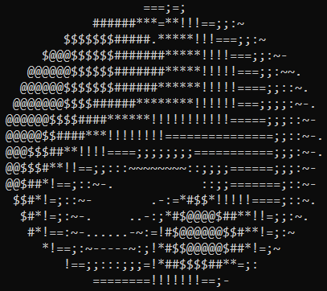

# Donut

This program (for Windows) renders a rotating, illuminated torus in the command prompt window. Illumination of the torus is represented by ASCII characters. Ready to run program can be found in the project folder.

The program was created on the basis of: [Link](https://www.a1k0n.net/2011/07/20/donut-math.html). The idea presented on the website I found interesting, but I think that the autor unnecessarly focused on the performance rather than a general concept of rendering. For my own curosity, I used his idea and rewritten his concept so that it could be used more generally.

## Simply about the program

Firstly, necessary constant variables are defined. Their meaning will be clear later.

Nextly, torus coordinates are defined. Beforehand, shifted (by *r2* in x-axis), circle coordinates (in x-y plane) must be defined, as torus is created by rotating the circle around certain axis (in this case y-axis). Having the circle coordinates defined, they are rotated around y-axis using defined for this purpose rotation matrix.

Having defined torus coordinates the normal vectors to that torus can be calculated. In this context, any the normal vector (of NOT unit length) can be treated as corresponding radius of the corresponding circle used to create corresponding coordinate of this torus. One can also notice, that any shift of the torus (without rotation and etc.) doesn't change the direction of its normal vectors (but can of course change the starting point of these vectors). Thus, normal vectors calculation can be simplified as it can be found in source code under the comment: "Definition of normal vectors to torus coordinates".

Program renders a rotating, illuminated torus. Having defined torus coordinates and the normal vectors, both of them can be rotated. Rotation of the torus coordinate implies the same rotation of the correspoding normal vector. The ilumination is calculated by taking the dot product of the light vector and the normal vectors.

Now everything must be project on the screen (somehow). In short, we use perspective projection. In other words, we see "the world" from the origin of the coordinate system along the z-axis. Bigger the x value means that something will be lower on the screen. Bigger the y value means that something will be more on the left on the screen (that's why in the code there is - sign in the line 188). Further something is from us (along z-axis), closer it appears to be to the center of view (z-axis) and thus (x, y) coordinates must be divided by z in the calculations. So we somehow get our destination pixel coordinate from the given torus coordinate. The further (from us along z-axis) torus coordinates should be covered by the closer ones. Closer torus coordinates have bigger one over z values. So, output buffer (buffer with the ASCII characters) is created as follows (in short):

1. For the given torus coordinate is calculated its location on the screen.
2. If screen already have coordinate rendered on this location, check if the newer coordinate is closer (to us along z-axis) than the previous one.
3. If yes, render the newer coordinate in the appropriate position with the appropriate illumination (if illumination>0).

It is simple overview of the program. Minor implementation details weren't discussed above, as they can be figured out analyzing the source code.

## Building the program

(Keep in mind, that ready to run program for Windows can be found in the project folder)

1. Have installed Visual Studio 2017 or later.
2. Open "Developer Command Prompt for VS" (Win + S and enter "Developer Command Prompt for VS").
3. Run cd command such that command prompt location is in the location of the project.
4. Run "Makefile.bat" (in the command prompt from previous point).

## Used library

[akalicki/matrix](https://github.com/akalicki/matrix)

## License

This project is released under the [MIT License](../LICENSE).