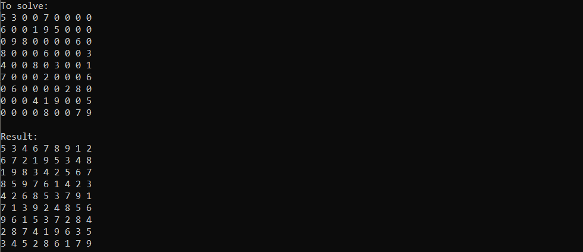

# SudokuSolver



This is a project of sudoku solver implemented using a backpropagation algorithm. Example of usage of the class `SudokuSolver` can be seen in the *main.cpp* file.

## Simply about the algorithm

Let's suppose that one want to solve the standard, solvable sudoku the brute force way. To not write horrible amounts of the for loops, which iterate through every possible combination of digits to fill the sudoku, a function should be written. This function would write these loops by itself by recursively calling itself something like this:

```cpp
bool Solve()
{
    // ...
    for(char i=0; i<9; i++)
    {
        // ...
        if(Solve())
        {
            return true;
        }
        else
        {
            // ...
        }
        // ...
    }
    // ...
}
```

This `Solve()` function dynamically creates these loops and can control their behaviour when it returns a value (in this example `bool`).

Solving the sudoku the brute force way is very complex, but this brute force way can be optimized. Solving the sudoku can be done by the way of trails and errors by checking possible solutions in some order. Let's take for example following sudoku:

```
5 3 0 | 0 7 0 | 0 0 0
6 0 0 | 1 9 5 | 0 0 0
0 9 8 | 0 0 0 | 0 6 0
---------------------
8 0 0 | 0 6 0 | 0 0 3
4 0 0 | 8 0 3 | 0 0 1
7 0 0 | 0 2 0 | 0 0 6
---------------------
0 6 0 | 0 0 0 | 2 8 0
0 0 0 | 4 1 9 | 0 0 5
0 0 0 | 0 8 0 | 0 7 9
```

It can be filled with digits (using basic sudoku rules) "naively", in sequential order like this:

```
5 3 0 | 0 7 0 | 0 0 0 || 5 3 1 | 2 7 4 | 6 9 8
6 0 0 | 1 9 5 | 0 0 0 || 6 2 4 | 1 9 5 | 7 3 0
0 9 8 | 0 0 0 | 0 6 0 || 0 9 8 | 0 0 0 | 0 6 0
--------------------- || ---------------------
8 0 0 | 0 6 0 | 0 0 3 || 8 0 0 | 0 6 0 | 0 0 3
4 0 0 | 8 0 3 | 0 0 1 || 4 0 0 | 8 0 3 | 0 0 1
7 0 0 | 0 2 0 | 0 0 6 || 7 0 0 | 0 2 0 | 0 0 6
--------------------- || ---------------------
0 6 0 | 0 0 0 | 2 8 0 || 0 6 0 | 0 0 0 | 2 8 0
0 0 0 | 4 1 9 | 0 0 5 || 0 0 0 | 4 1 9 | 0 0 5
0 0 0 | 0 8 0 | 0 7 9 || 0 0 0 | 0 8 0 | 0 7 9
```

Note, that *under these assumptions* no further digits from 1 to 9 can be entered. Thus *contradiction* was reached and the previous *assumptions* should be updated with the next, possible solutions. In this example `3` (from 2nd row and 8th column) replaced with `4` fails and also fails `5`, ..., `9`. So `3` is replaced with `0` and under consideration is taken the previous digit (`7`). `7` replaced by `8` and `9` also fails. So `7` is replaces with `0` and under consideration is taken the previous digit (`5`). `5` can be replaced with `8` and the next digit is taken under consideration and etc. All in all, this paragraph can be sumed up to the following:

1. Fill sequentially sudoku with the lowest possible digits.
2. Once reached contradiction (no digit can be entered), go back (`Solution()` returns `false`) and repeat step 1 with the **next**, lowest possible digits.
3. Follow these steps as long, as the whole sudoku is filled with digits (`Solution()` returns `true`).

After reading this paragraph, understanding the meaning of `Solve()` method of `SudokuSolver` class should be easier.

## Building the program

(Keep in mind, that ready to run program for Windows can be found in the project folder)

1. Have installed Visual Studio 2017 or later.
2. Open "Developer Command Prompt for VS" (Win + S and enter "Developer Command Prompt for VS").
3. Run cd command such that command prompt location is in the location of the project.
4. Run "Makefile.bat" (in the command prompt from previous point).

## License

This project is released under the [MIT License](../LICENSE).